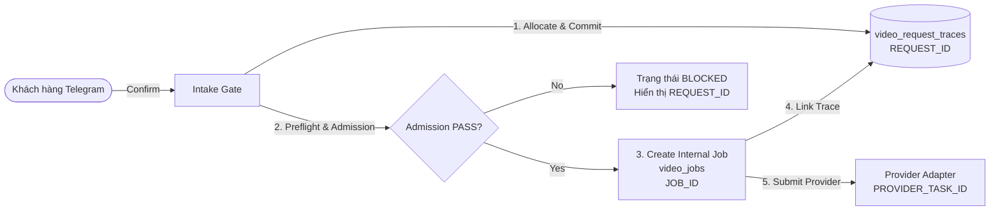

# Mẫu Thiết Kế Hệ Thống TOAN AAS (System Design Patterns)

Tài liệu chuẩn hóa kiến trúc phân tán cho hệ thống Bot Telegram kết nối Railway và Ubuntu VPS Worker.

---

## 1. MẪU THIẾT KẾ PHÂN TÁCH ID 3 TẦNG (THREE-TIER ID DECOUPLING)

### Nguyên tắc:
- `REQUEST_ID` được sinh trước và cam kết bền vững trước mọi điều kiện rẽ nhánh.
- `JOB_ID` chỉ sinh khi hệ thống sẵn sàng xử lý.
- `PROVIDER_TASK_ID` chỉ sinh khi thực sự gửi payload sang bên thứ ba.

---

## 2. MẪU THIẾT KẾ WORKER GENERATION FENCING (CHỐNG SPLIT-BRAIN)

Khi triển khai Worker phân tán trên VPS:
1. Mỗi khi service worker khởi động lại, sinh ra một `generation_id` duy nhất (UUIDv4).
2. Khi Worker gửi request Claim / Heartbeat, gửi kèm `worker_id`, `generation_id`, và `git commit SHA`.
3. Server Bot (Railway) kiểm tra:
   - Nếu `worker_sha != bot_sha` -> Từ chối Claim (`reason=worker_sha_mismatch`).
   - Nếu Worker gửi `generation_id` cũ sau khi instance mới đã claim -> Từ chối (`reason=worker_generation_conflict`).

---

## 3. MẪU THIẾT KẾ CƠ SỞ DỮ LIỆU SQLITE WAL TRÊN VOLUME MOUNT

- Sử dụng cơ chế Write-Ahead Logging (`PRAGMA journal_mode=WAL`).
- Tăng `PRAGMA busy_timeout=30000` để các luồng đọc/ghi không bị khóa chết (`database is locked`).
- Luôn sử dụng hàm resolver trung tâm (`services.video_trace_state.get_canonical_db_path()`) để mọi module dùng chung 1 đường dẫn DB duy nhất (`/data/toandaas_system.db`).
